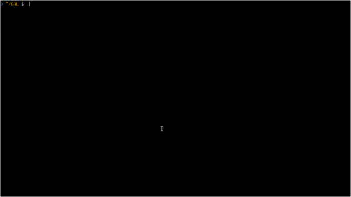

# GOL
A simple Conway's Game of Life implementation in C

## Download and compilation

Simply:

```
git clone 'https://github.com/DarkAdin/GOL.git'
cd GOL
make
./GOL
```

Modifiable parameters:

* Dimensions of the grid
* Probability of life in a cell
* ```char``` representation of life and death states
* Velocity of evolution in microseconds (```usleep()```)

## Coming soon

* Reading a predefined grid of life from disk


